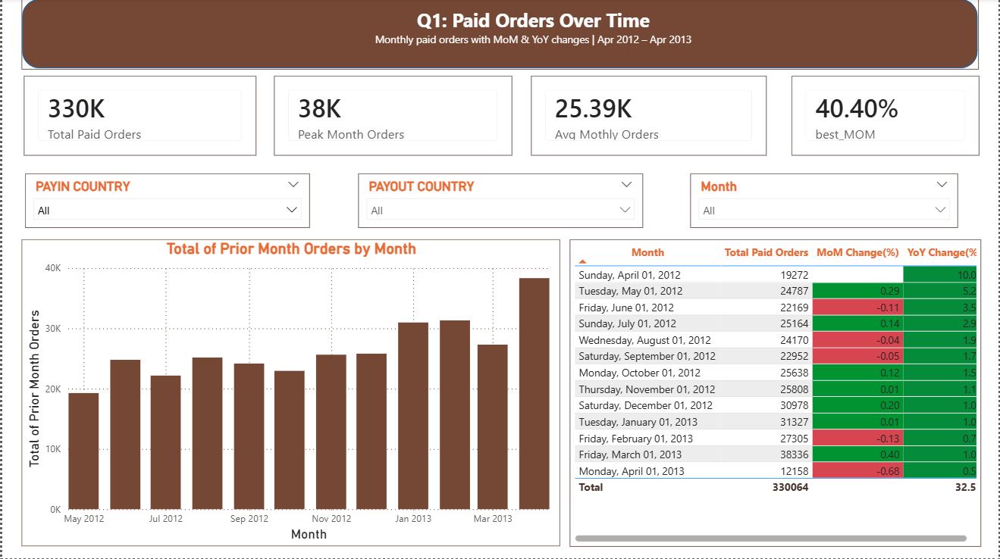
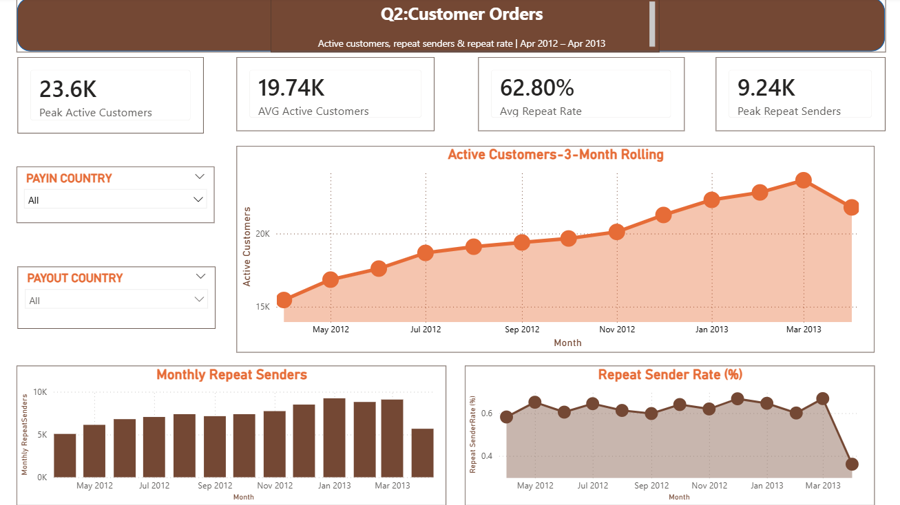

# Mukuru Remittance Analysis — Data Analytics Case Study


## Overview

End-to-end data analysis of a fintech remittance dataset spanning 13 months
(April 2012 to April 2013). The analysis covers paid order volume trends,
customer retention metrics and data quality validation across Mukuru's
Southern African remittance corridors.

The project was completed as a technical assessment for a Data Analytics
Intern role at Mukuru, a leading African fintech company specialising in
international and domestic money transfers.

---

## Business Context

Mukuru's core business is remittances — helping customers move money across
Africa, primarily from South Africa to Zimbabwe, Malawi, Zambia and other
Southern African countries. This analysis answers two key business questions:

- **Commercial Team:** How are paid order volumes trending month on month
  and year on year?
- **Customer Journey Team:** How large is the active customer base and how
  many customers are returning senders each month?

---

## Dataset

The dataset consists of 568,638 remittance orders across 6 related tables:

| Table | Description |
|---|---|
| Orders | Core transaction table — one row per order |
| Users | Customer master table — one row per customer |
| Country | Country dimension — maps CountryKey to country name |
| Currency | Currency dimension — maps CurrencyKey to currency |
| CustomerAcquisitionCosts | CAC by brand, year and channel |
| PayInPartnerCommercials | PayIn partner rate information |

**Note:** Raw datasets are not included in this repository as they contain
proprietary business data. The SQL scripts, analysis workings and findings
report are included as the analytical deliverables.

---

## Project Structure

```
mukuru-remittance-analysis/
│
├── README.md
│
├── sql/
│   └── mukuru_analysis.sql          # All SQL queries for Q1 and Q2
│
├── excel/
│   └── Mukuru_Excel_Workings.xlsx   # Calculation workings with live formulas
│
├── report/
│   └── Mukuru_Analysis_Report.docx  # Full findings report with insights
│
└── assets/
    ├── dashboard_q1.png             # Power BI dashboard — Q1 Paid Orders
    └── dashboard_q2.png             # Power BI dashboard — Q2 Customer Metrics
```

---

## Analysis Questions

### Question 1 — Paid Orders Over Time (Commercial Team)

Calculated for the last 13 months with PayIn Country, PayOut Country
and Date filters:

- Total number of Paid Orders per month
- Month-on-Month (MoM) % change
- Year-on-Year (YoY) % change

**Key findings:**
- 330,064 total paid orders across the 13-month window
- Every month delivered positive YoY growth, ranging from +53.9% to +1,006.9%
- March 2013 was the peak month with 38,336 orders (+40.4% MoM)
- December 2012 showed a +20.0% festive season surge
- Zimbabwe corridor accounts for 72% of all payout volume

### Question 2 — Active Customers & Monthly Repeat Senders (Customer Journey Team)

Calculated for the last 13 months with PayIn Country and PayOut Country filters:

**2.1 Active Customers:** 3-month rolling count of distinct customers
who paid for at least one order

**2.2 Monthly Repeat Senders:** Customers who transacted in both the
current month and the preceding month, plus the Repeat Sender Rate (%)

**Key findings:**
- Active customers grew from 15,458 to 23,648 — a 53% increase in 11 months
- Growth was unbroken — every single month increased without exception
- Average Repeat Sender Rate of 62.7% across 12 complete months
- December 2012 peak repeat rate of 66.7% — festive season re-activation effect

### Question 3 — Data Quality Validation

Described a structured 7-step approach to validating data quality, grounded
in real observations from this dataset including sentinel date conventions,
referential integrity checks, business logic validation and volume
plausibility assessment.

---

## Key Metric Definitions

| Metric | Definition |
|---|---|
| Paid Order | Order where OrderPaid contains a valid date, excluding sentinel values 1900-01-01, 1970-01-01 and 0 |
| Cancelled Order | Excluded where OrderCancelled contains a valid non-sentinel date |
| MoM % | (Current Month - Prior Month) / Prior Month × 100 |
| YoY % | (Current Month - Same Month Prior Year) / Same Month Prior Year × 100 |
| Active Customers | 3-month rolling count of distinct SenderKeys who paid for at least one order |
| Monthly Repeat Senders | Customers who transacted in both the current month and the preceding month |
| Repeat Sender Rate % | Monthly Repeat Senders / Transacting Customers in preceding month × 100 |

---

## Dashboards

### Q1 — Paid Orders Over Time


### Q2 — Customer Metrics


---

## Tools Used

| Tool | Purpose |
|---|---|
| PostgreSQL / SQL | Data extraction, filtering and aggregation |
| Python (Pandas) | Data validation and calculation verification |
| Microsoft Excel | Structured workings with live formulas |
| Power BI | Interactive dashboard with slicers |

---

## Data Observations

Several data quality observations were noted during the analysis:

- **Sentinel dates** used in OrderPaid and OrderCancelled fields (1900-01-01,
  1970-01-01, 0) to represent null or unpaid states — required specific
  filtering logic
- **Botswana PayIn** had only 138 orders versus 568,500 for South Africa —
  likely a new market or limited data coverage for this period
- **April 2013** is a partial month with data to 14 April only — YoY for
  this month uses MTD vs MTD comparison for a fair like-for-like view
- **Four unnamed null columns** present across all rows — identified and
  excluded from analysis

---

## Author

**Phemelo Sebopelo**
BSc Information Technology — Richfield Graduate Institute of Technology (2025)

[GitHub](https://github.com/Phemelocodemode) |
[LinkedIn](https://www.linkedin.com/in/phemelo-sebopelo-a428712b2/) |
phemelosebopelo14@gmail.com
